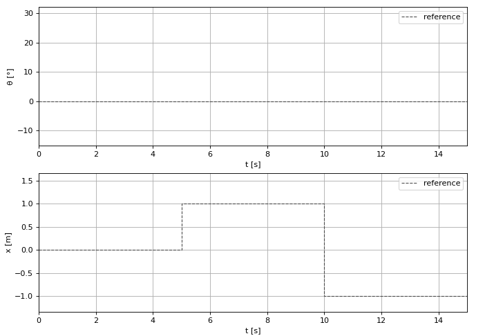

<h1 align="center">
INVERTED PENDULUM CONTROL USING GENETIC ALGORITHM
</h1>

## Welcome!

This project's purpose is to implement a genetic algorithm in order to determine parameters of an inverted pendulum full-state feedback controller $K$.
In other words - **the point of this approach is to keep the pendulum in a vertical position at a predefined point without knowing maths and physics behind it.**

The **main.py** is the main file which you can execute in order to start a simulation and which contains a basic system configuration
where you can choose some inverted pendulum parameters as well as the genetic algorithm ones.
You can also choose LQR controller in order to compare it with the genetic algorithm based controller.

## System control
Let's compare how the genetic algorithm does its job in comparison to based on mathematical derivations LQR controller - for this purpose, let's define the inverted pendulum's physical properties, create some simulation scenario with the system's initial conditions vector $\underline{x_0}$ and define reference values.

### Physical properties
- Pendulum:
  - length: $0.8 \text{ } m$,
  - mass: $0.3 \text{ } kg$,
  - friction: $0.05$.
- Cart:
  - mass: $0.6 \text{ } kg$,
  - friction: $0.1$.
- Gravitational acceleration: $9.81 \text{ } m/s^2$.

### Initial conditions
Vector $\underline{x_0}$ stands for initial conditions of the inverted pendulum system. Its values correspond to the pendulum angle $\theta$, the pendulum angular velocity $\omega$, the cart position $x$ and the cart linear velocity $v$, accordingly.

````math
\underline{x_0} = \begin{bmatrix}\theta_{0} \\ \omega_{0} \\ x_{0} \\ v_{0} \end{bmatrix} = \begin{bmatrix} 30^{\circ} \\ 1.74 \; \frac{rad}{s} \\ 3 \; m \\ -2 \; \frac{m}{s} \end{bmatrix} $$
````

### Reference values
The point of the inverted pendulum control is to make it maintain a predefined angle $\theta_{des}$ and a predefined position $x_des$. The graph below ilustrates their desired values over time, marked as *reference* with a dashed line:

<p align="center"></p>

## LQR control approach
This strategy allows to compute the controller's $K$ values by the inverted pendulum's system linearization. This is in order to define its state-space which can be then used, along with weighting matrices $Q$ and $R$, to solve the Riccatti equation which eventually leads to the $K$ vector.

The state-space matrices have been determined as follows:

```math
        \begin{gathered}
            \underline{A} = 
            \begin{bmatrix}
                0 & 1 & 0 & 0\\
                \frac{2Lgm(-M - m)}{L^2Mm + 4IM + 4Im} & \frac{4b(-M - m)}{L^2Mm + 4IM + 4Im} & 0 & \frac{2BLm}{L^2Mm + 4IM + 4Im}\\
                0 & 0 & 0 & 1\\
                \frac{L^2gm^2}{L^2Mm + 4IM + 4Im} & \frac{2Lbm}{L^2Mm + 4IM + 4Im} & 0 & \frac{B(-L^2m - 4I)}{L^2Mm + 4IM + 4Im}
            \end{bmatrix}\\\\
            \underline{B} =  
            \begin{bmatrix}
                0 \\
                \frac{-2Lm}{L^2Mm + 4IM + 4Im} \\
                0 \\
                \frac{L^2m + 4I}{L^2Mm + 4IM + 4Im}
            \end{bmatrix}\;
            \underline{C} =  
            \begin{bmatrix}
                1 & 0 & 0 & 0\\
                0 & 0 & 1 & 0
            \end{bmatrix}\;
            \underline{D} = 
            \begin{bmatrix}
                0 \\
                0
            \end{bmatrix}
        \end{gathered}
```

The weighting matrices have been defined as follows:
```math
        \underline{Q} = 
        \begin{bmatrix}
            1 & 0   & 0     & 0\\
            0 & 100 & 0     & 0\\
            0 & 0   & 22500 & 0\\
            0 & 0   & 0     & 5000
        \end{bmatrix}
        \\
        \underline{R} = 1
```

Animation below shows how the LQR controller manages to stabilize the system:

<p align="center"></p>

## Genetic algorithm based controller
In order to proceed with the genetic algorithm approach, its parameters have to be firstly determined.
After several simulations, values leading to the best solutions with respect to computational effort, have been determined as follows:
- population size: 20,
- chromosome size: 4,
- gene bounds: (0, 100.01),
- mutation probability: 0.2,
- crossover probability: 0.4,
- crossover rate: 0.2.

An objective function, being the most crucial genetic algorithm's parameter directly responsible for the evolution curve shape has been determined as follows:
```math
f = \frac{t_{max}^{2}}{\int_{0}^{t_{max}} |x(t) - x_{des}(t)| \,dt }
```

Why integral of a pendulum's angle to ensure staying in upright postion hasn't been included?
Because simulation is terminated every time when pendulum's angle exceeds 90 degrees. The quicker it does so, the less the simulation time. The less the simulation time, the less the value of objective function defined above. The less the value of objective function, the less likely to survive is the given individual causing pendulum to fall. ~~The less likely the given~~ ok let's finally check out how does this stuff work.

The fittest individual of 100 generations:
<p align="center"></p>

## Conclusions
The plot below shows comparison between the mathematically derived LQR and the genetic algorithm approach.
<p align="center"></p>

The LQR advantage over the genetic algorithm based controller can be clearly seen. But is it so in every scenario? How about varying friction? Varying masses? The LQR controller concept is about linearization of the inverted pendulum mathematical model. If we add to the model more non-linearities (by changing assumed as constant physical properties mentioned earlier to varying), we will be able to observe how linearized model differs from the "realistic" one.

## Non-linear system control
### Varying pendulum's friction
Let's start with the pendulum friction. We defined its value before as 0.05. But in the reality it is not constant over the whole angular range within which pendulum can rotate. From the realistic example we could expect the friction to be greater at some points and less at the others. Let's arbitrary define its change with respect to the angular position of the pendulum as on the graph showed below:
<p align="center"></p>

Comparison of both approaches in this scenario:
<p align="center"></p>

Looks like this time it was easier for the genetic algorithm based controller to catch up with the LQR.

### Varying cart's friction
Again, we arbitrary define friction change over the cart's position
<p align="center"></p>

All together put on one graph:
<p align="center"></p>

The plot above shows that for shorter distances between $x_{des}$ points, the genetic algorithm approach seem to stabilize the system quicker than the LQR.

### Varying pendulum's mass
Finally, let's investigate an impact of varying in time pendulum's mass on control conditions.
<p align="center"></p>

Graph showing simulation outocomes for both approaches:
<p align="center"></p>

Here the advantage of genetic algorithm based controller is less visible. The reason for such case is the probabilistic nature of this strategy - the solutions does not necessarily always have to converge to an actual objective function's minimum.

