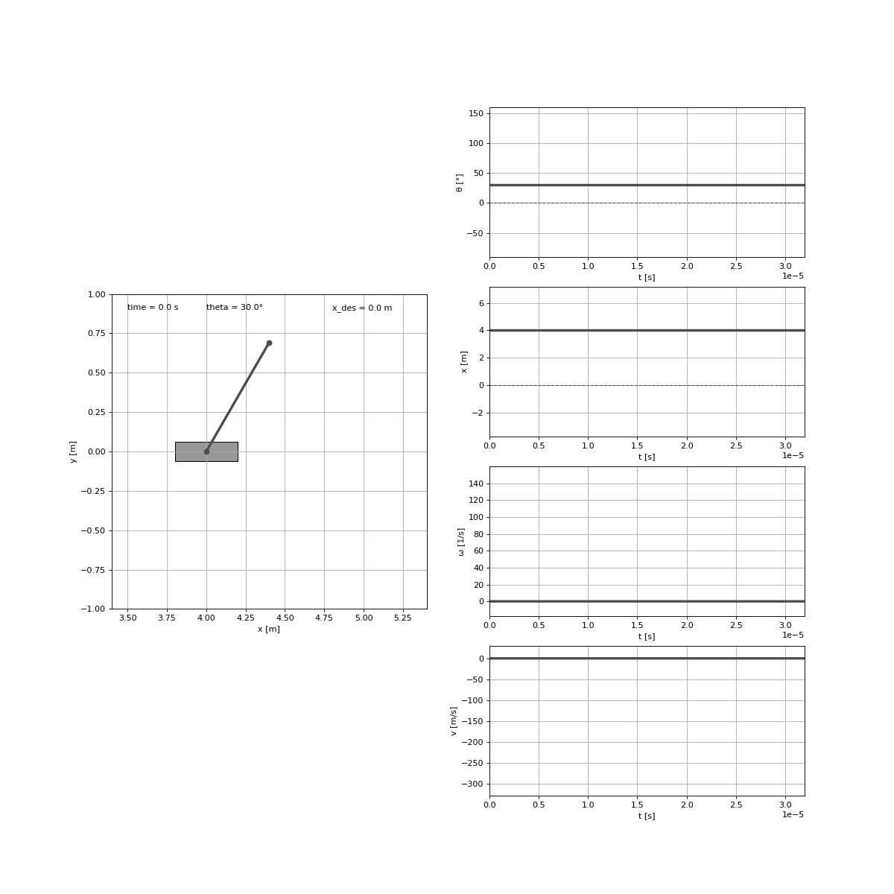

# Inverted pendulum control using genetic algorithm
## Welcome!

This is a project implementing a genetic algorithm to determine parameters of an inverted pendulum controller.
In other words - **the point is to keep inverted pendulum in a vertical upright position without knowing maths and physics behind it.**

The **main.py** file is the main file which you can execute in order to start a simulation and which contains basic system configuration
where you can choose some inverted pendulum parameters as well as genetic algorithm's ones.
You can also choose LQR controller in order to compare it with genetic algorithm controller.

Ok, but let's see how does it actually work.

# System control
Let's compare how does the genetic algorithm do its job in comparison to based on mathematical derivations LQR controller.

For that purpose, let's create some simulation scenario:

- Initial conditions:
  - position: 4 m,
  - velocity: 0 m/s,
  - angle: 30 deg,
  - angular velocity: 0 deg/s.
- Reference values:
  - angle: 0 deg,
  - position:
    - from 0 s to 5 s:  0 m,
    - from 5 s to 10 s: 0.8 m,
    - from 10 s to 15 s: -0.5 m.
    
 Let's also choose some system's physical parameters:
- Pendulum:
  - length: 0.8 m,
  - mass: 0.3 kg,
  - friction: 0.05.
- Cart:
  - mass: 0.6 kg,
  - friction: 0.1.
 
Let's check how would this system behave inside a rocket traveling through space with a constant acceleration of g = 9.81 m/s^2.

Ok, everything is set up, so let the battle begin!
Player 1 is...

## LQR based controller
Animation below shows how does the LQR controller manage to stabilize the system:

Looks pretty cool, as we could expect. It bases on mathematical derivations after all. Let's go to Player 2...

## Genetic algorithm based controller
Parameters:
- population size: 50,
- chromosome size: 4,
- gene bounds: (-100.01, 100.01),
- mutation probability: 0.2,
- crossover probability: 0.4,
- crossover rate: 0.2)

Objective function is to minimise an integral of a difference between position and a reference position over time which is then multiplied by squared simulation time.

Why won't we include integral of a pendulum's angle to ensure staying in upright postion?
Because simulation is terminated every time when pendulum's angle exceeds 90 degrees. The quicker it does so,
the less the simulation time. The less the simulation time, the less the value of objective function defined above. The less the value of objective function,
the less likely to survive is the given individual causing pendulum to fall. ~~The less likely the given~~ ok let's finally check out how this stuff works.

The fittest individual of 100 generations:

# Conclusions
Seems like LQR wins the battle. But is it so in every scenario? How about varying friction? Varying masses? Random forces acting on a cart? These questions and related to them doubts will be cleared soon.

For now, as a bonus, check out how the evolution process looked like:

# Bonus - evolution process

 -- GENERATION 1 --   

 -- GENERATION 5 --   

 -- GENERATION 10 --   

 -- GENERATION 20 --   

 -- GENERATION 50 --   

 -- GENERATION 75 --   

